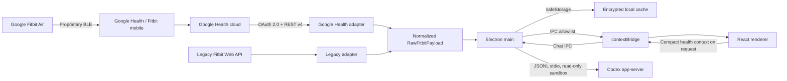

# Architecture

## Goals

- Fast desktop UI that remains useful without an account through demo data.
- Google Health API v4 as the primary provider, with the legacy Fitbit Web API isolated as a fallback.
- No tokens or secrets in the renderer.
- Partial consent and missing sensors must not block the dashboard.
- Encrypted per-day health archive and no upload to OpenFit services. Completed days are read locally without new provider requests. If `safeStorage` is unavailable, or Linux selects the unencrypted `basic_text` backend, saving fails explicitly.
- One normalization layer, so views do not depend on remote API shapes.
- Optional chat through Codex app-server. The project contains no API key, and no health data is sent until the user sends a message.

## Flow



## Security Boundaries

### Main Process

The main process is the only process allowed to:

- open the OAuth loopback server;
- know the Client Secret, access token, and refresh token;
- call `health.googleapis.com` and `api.fitbit.com`;
- read and write cache and credentials;
- open external URLs and export files only after explicit user action;
- start Codex app-server and forward only the compact health context prepared for the turn.

### Preload

The preload exposes an operation allowlist through `contextBridge`. It does not expose Node, the filesystem, generic `ipcRenderer`, or tokens. Chat events are limited to status, text deltas, completion, errors, and cancellation.

### Renderer

The renderer runs with `nodeIntegration: false`, `contextIsolation: true`, and sandboxing enabled. It receives public status and credential-free health payloads, then normalizes and compacts only the metrics needed before a Codex turn.

### Codex Bridge

`codex-service.cjs` resolves the Codex Desktop executable, starts `codex app-server` over stdio, and reuses the local authentication. Every thread uses `read-only`, `approvalPolicy: never`, and disabled network access for tools. Shell, patch, permission, input, and tool requests are denied by the client. Fitbit and Google OAuth credentials never enter the model context.

## Provider Contract

Each adapter implements:

```text
createPkce()
createAuthorizationUrl(config, state, pkce)
exchangeAuthorizationCode(config, code, verifier)
refreshAccessToken(config, token)
revokeToken(token)
syncData(accessToken, date, onProgress)
```

The main process selects the adapter from `config.provider`. The UI always receives the same `RawFitbitPayload` contract, then `normalizeFitbitData` converts it into `DashboardData`.

## Resilience

- API reads are independent. A 403 or 404 response for ECG or temperature does not cancel steps and sleep.
- Each error is tied to its source and shown on the Devices page.
- Google Health is limited to fewer than five requests per second. `429` responses receive a retry with backoff.
- The token is refreshed before expiry. Rotated refresh tokens are saved atomically.
- Encrypted writes use a temporary file plus rename to avoid partial caches.
- A mostly failed sync does not replace the latest valid cache, and concurrent syncs are serialized.

## Deliberate Decisions

1. **No reverse-engineered BLE.** It is not a supported interface and would make pairing and data access fragile or unsafe.
2. **System browser for OAuth.** No Google or Fitbit password passes through Electron.
3. **Dual provider.** This matches Google's recommended migration strategy, and the renderer does not contain API branching.
4. **Demo first.** Visual development and tests do not require real health data.
5. **Read-only scopes.** OpenFit does not modify the user's health profile.

## Public Distribution Note

The documented Google Health client is a Web client and uses a Client Secret. `safeStorage` protects it on the user's computer, but a secret distributed inside a desktop app is not a true global secret. To distribute OpenFit to third parties, move the OAuth exchange to a minimal backend, complete Google verification, and complete the required security review. The current setup is appropriate for personal use and development.
